*On se positionne dans le dossier welcome-to-docker
cd welcome-to-docker
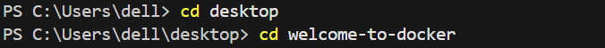
*Créer l’image docker à partir de ce projet de sorte que le fichier dockerfile soit pris en compte
docker build -t mon-app-perso:1.0 .
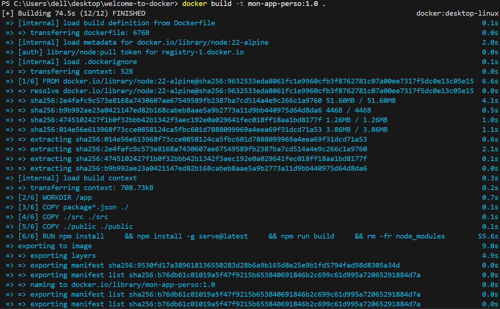
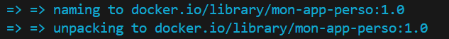
*Lancer l’image docker que vous venez de créer et lancer un container avec
docker run -d --name mon-serveur-web -p 8080:3000 mon-app-perso:1.0
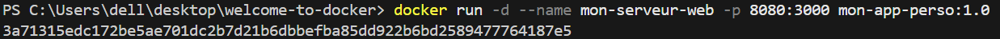
*Accéder au container pour visualiser le résultat
docker ps
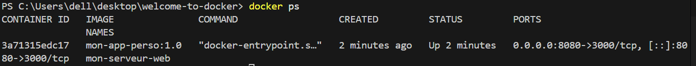
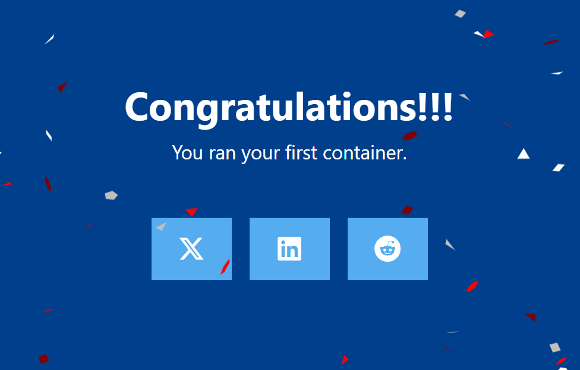

Pour que la modification de code prend effet il faut supprimer le conteneur et le recréé
docker stop 8f98e7e87873
docker rm 8f98e7e87873
docker build -t mon-app-perso:1.0 .
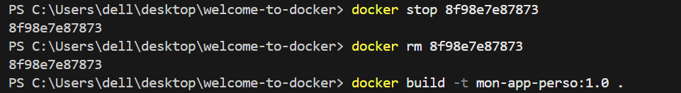
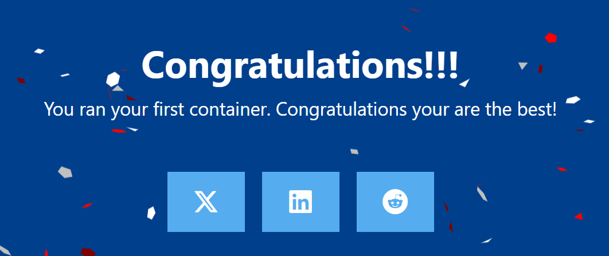

Publier sur votre compte docker une image docker, et rendez la disponible à un membre de votre promo
Il faut s’identifier sur le Docker Hub : docker login
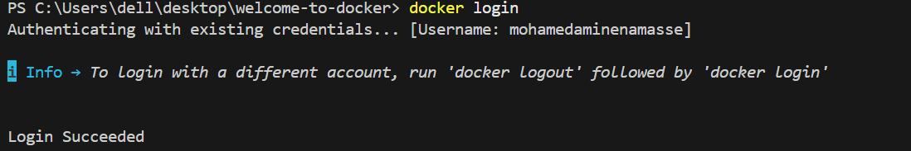
Il faut mettre un tag: docker tag mon-app-perso:1.0 mon-username-docker/mon-app-perso:1.0
et apres on push vers Dockerhub avec: docker push
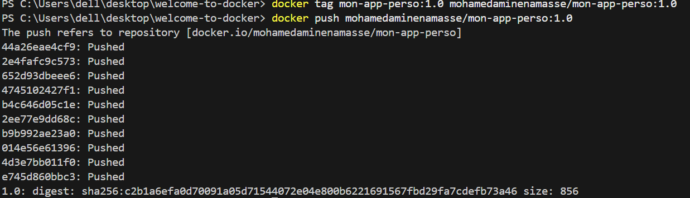

lien vers l'image dockerhub : https://hub.docker.com/layers/mohamedaminenamasse/mon-app-perso/1.0/images/sha256:c2ad13402ec60b05827d5a173e6fda92255b852055e76c98fea38645584fc0ab?uuid=866C01D5-F0A4-4C4D-861C-F9AD981A0277

Recuperation image de cosmin
docker pull cosminbilga/welcome-to-docker  
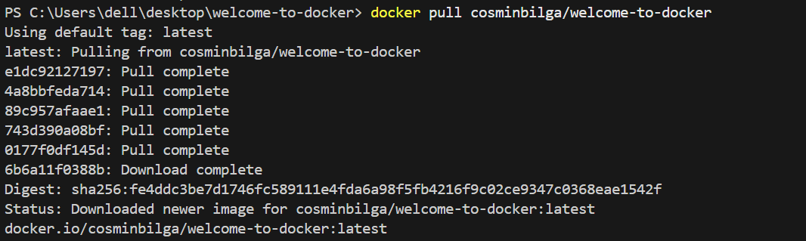
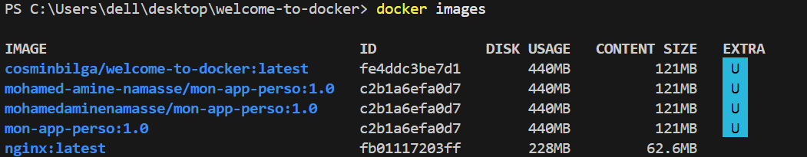
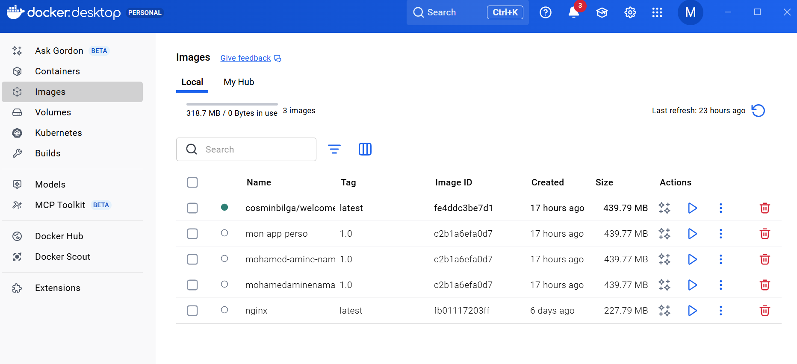

Visualisation image de cosmin
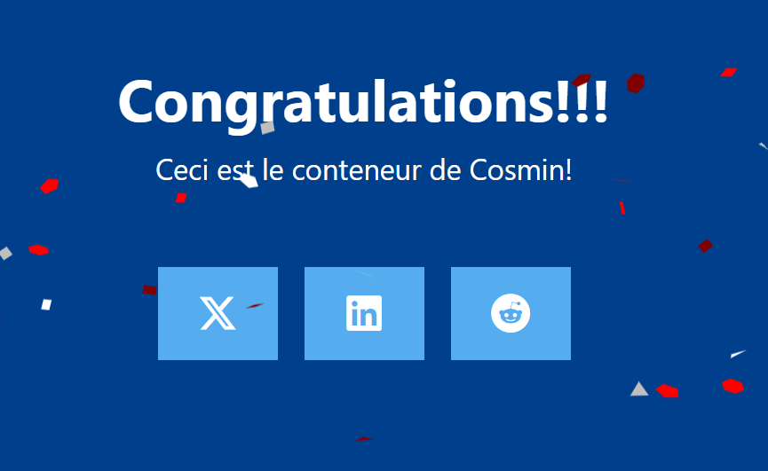
