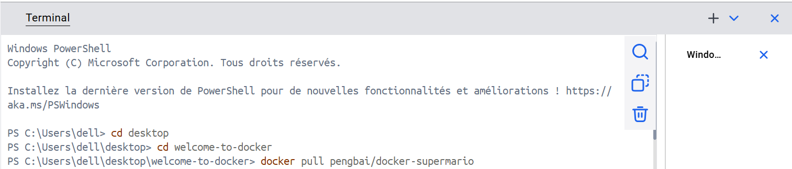
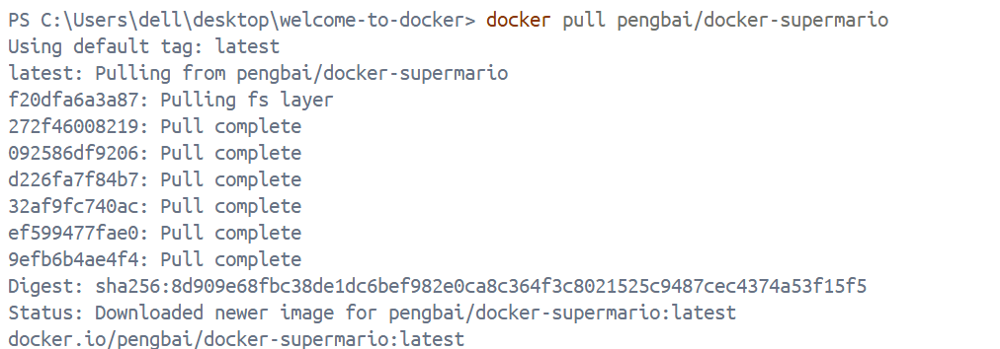
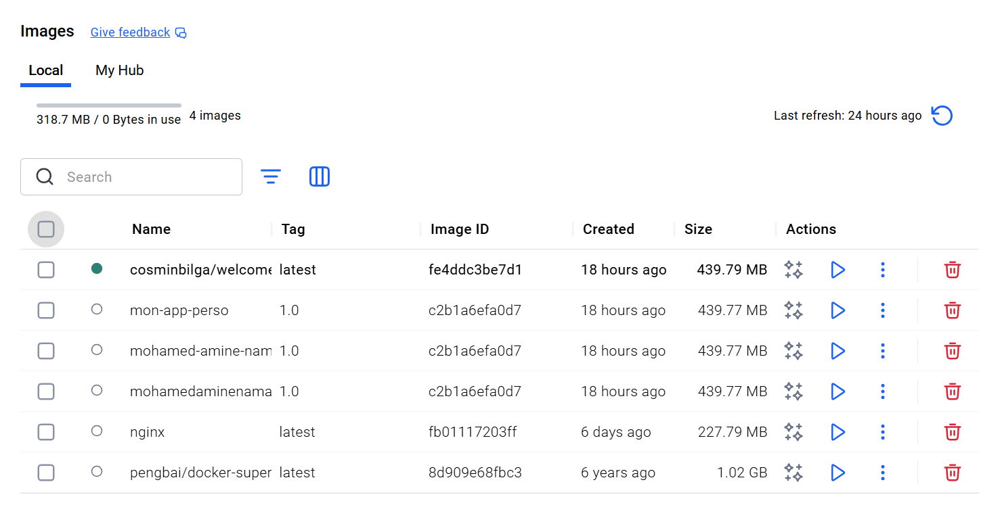
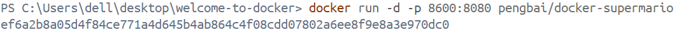
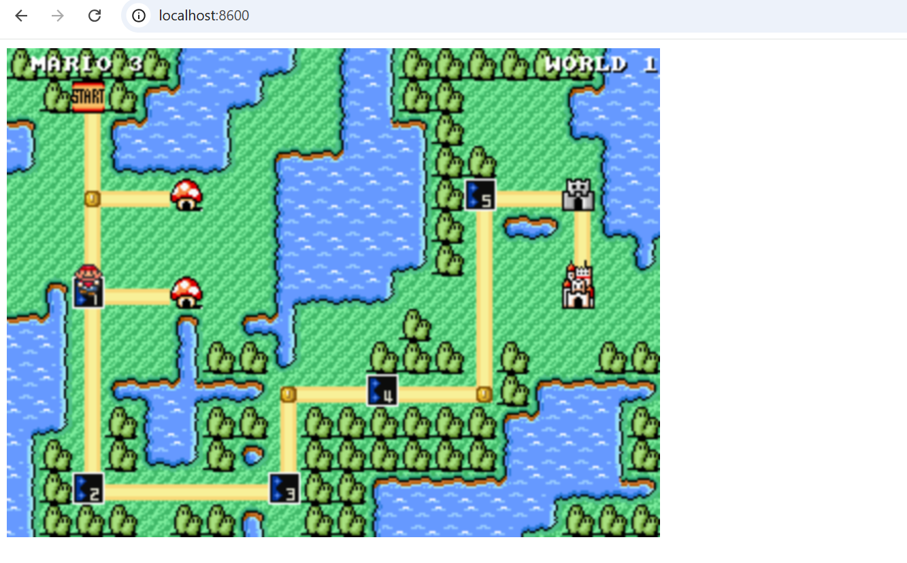

On se met dans le dossier welcome-to-docker et on tape docker pull pengbai/docker-supermario

On remarque que l'image mario a bien été ajouté

On lance l'image sur le port 8600 en considérant que l’image est configuré sur le port 8080 et on visualise sur navigateur

