On se met dans le dossier welcome-to-docker et on tape docker pull pengbai/docker-supermario

On remarque que l'image mario a bien été ajouté

On lance l'image sur le port 8600 en considérant que l’image est configuré sur le port 8080 et on visualise sur navigateur

On peut egalement demarrer le conteneur manuellement on cliquant sur start
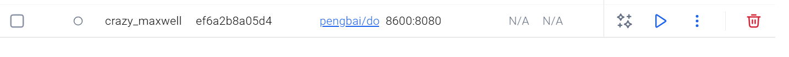
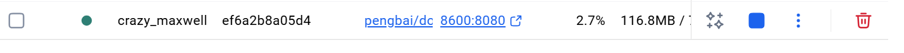

On lance le jeu sur un autre port 8800 par exemple
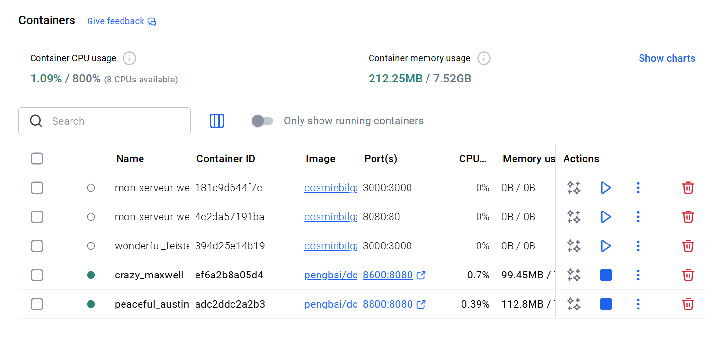
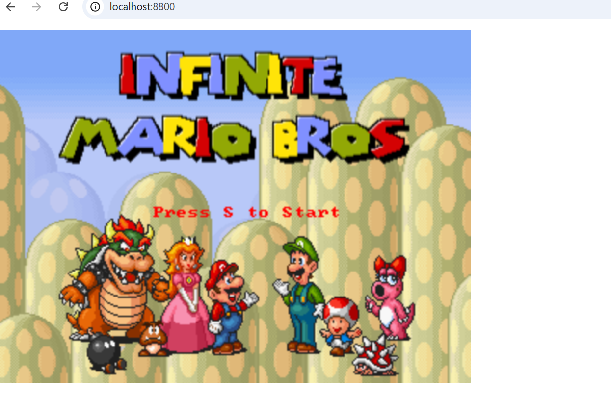
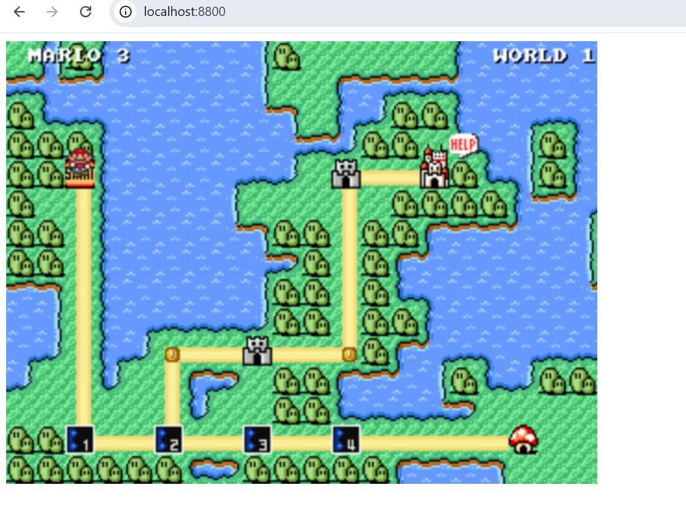
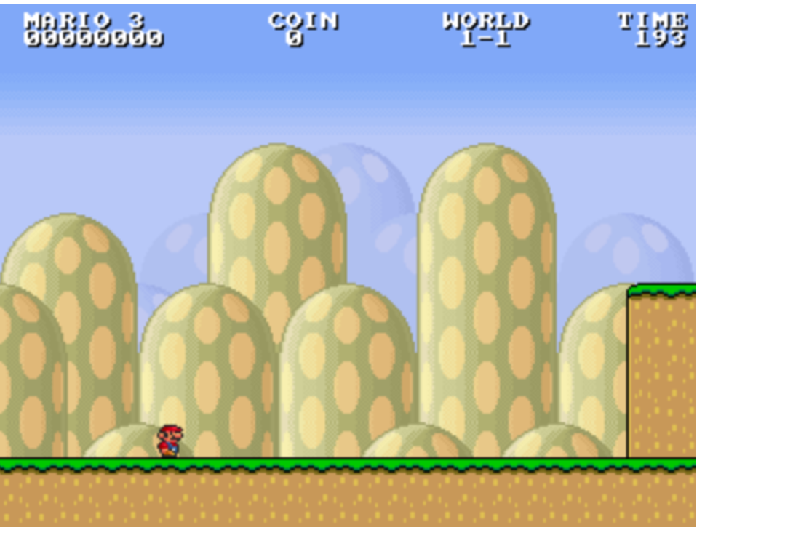
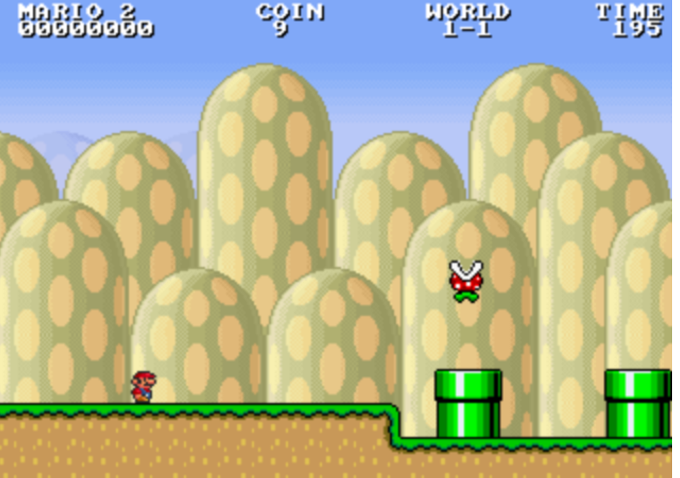
Pour trouver l'id du conteneur a arreter on fait docker ps qui afficher les conteneurs en cours d'execution
ou on le voit directement sur docker desktop
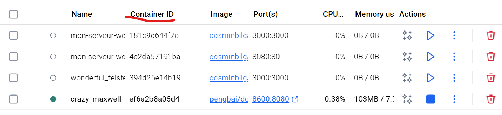
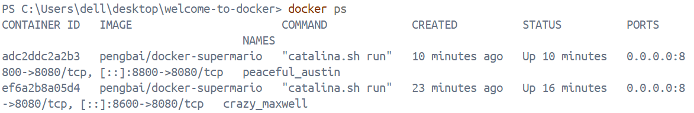

Pour supprimer le conteneur deux manières soit manuellement en cliquant sur delete ou à l'aide de la commande
docker stop puis docker rm
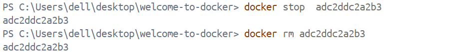
On voit bien que le conteneur avec le port 8800 a bien été supprimé
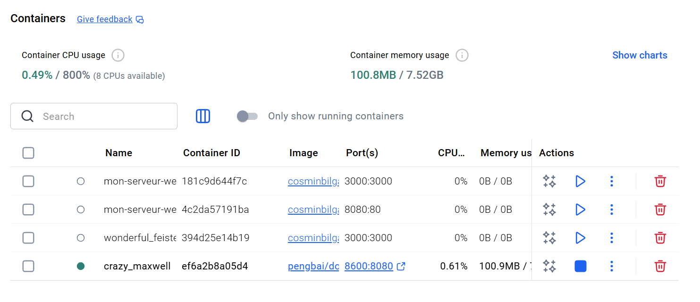

pour supprimer l'image docker images puis docker rmi -f id_image ou manuellement en cliquant sur delete sur images de docker desktop
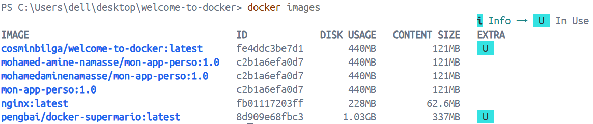
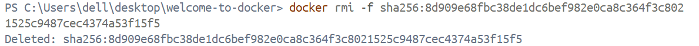
on voit bien que l'image n'existe plus
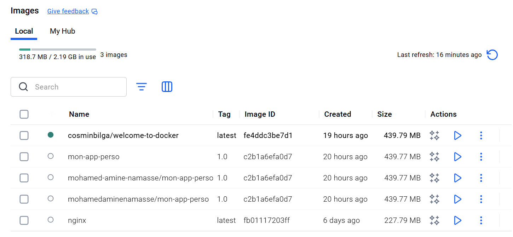
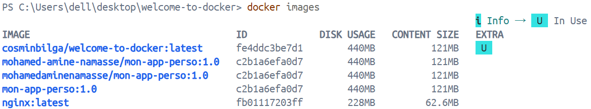
