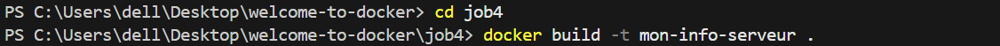
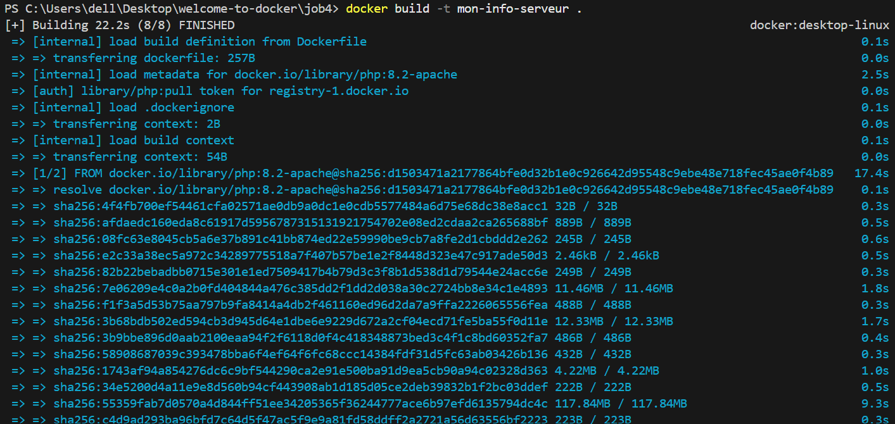
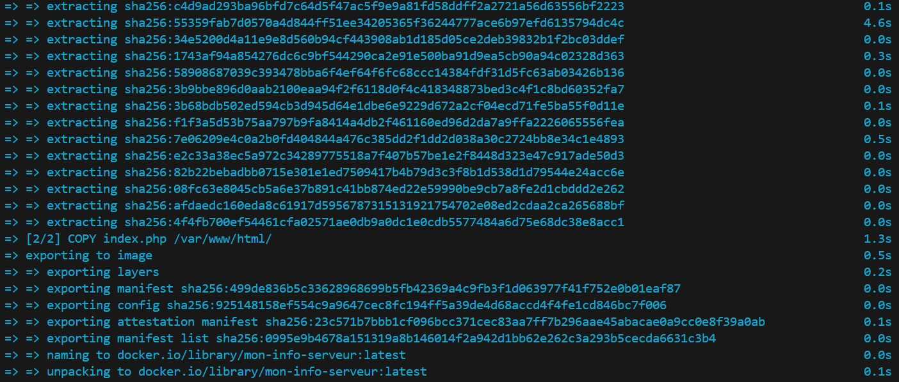
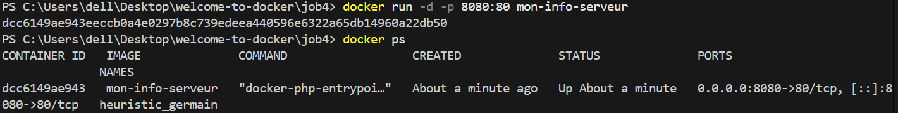
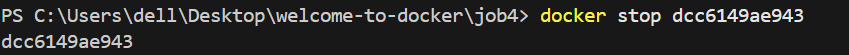

On se met de dans le dossier job4 après on fait docker build

on le lance avec docker run -d -p 8080:80 mon-info-serveur

on visualise les conteneurs en cours d'execution avec docker ps puis on le stop avec son id

