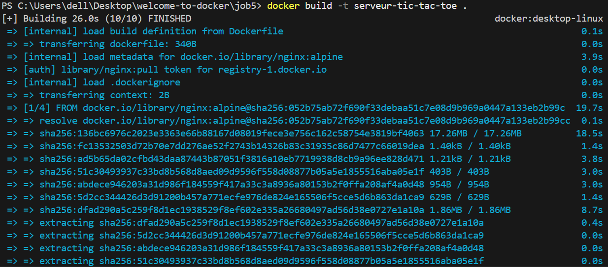
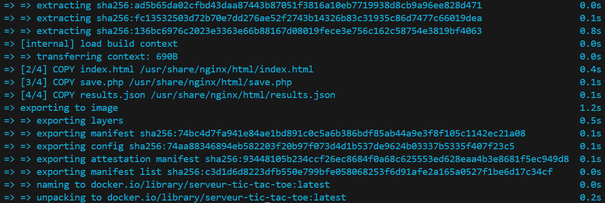
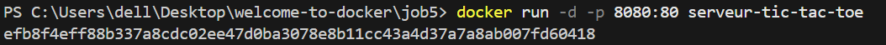
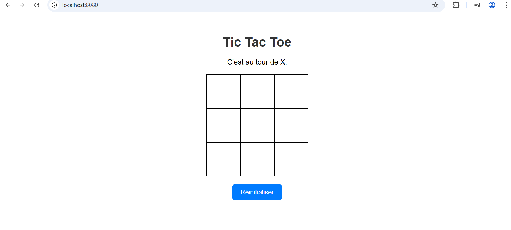
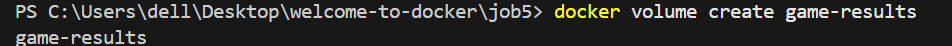
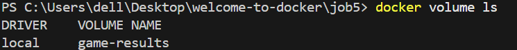
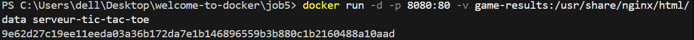

on construit l'image docker avec docker build -t

on la visualise sur navigateur sur le port 8080 apres avoir fait docker run

On crée un volume
docker volume create game-results

On liste les volumes on voit bien que le volume game-results a bien été créé

On relie le volume au conteneur
docker run -d -p 8080:80 -v game-results:/usr/share/nginx/html/data serveur-tic-tac-toe

