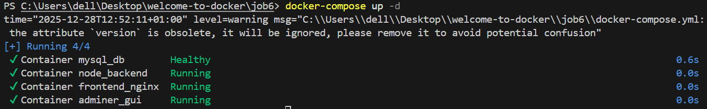
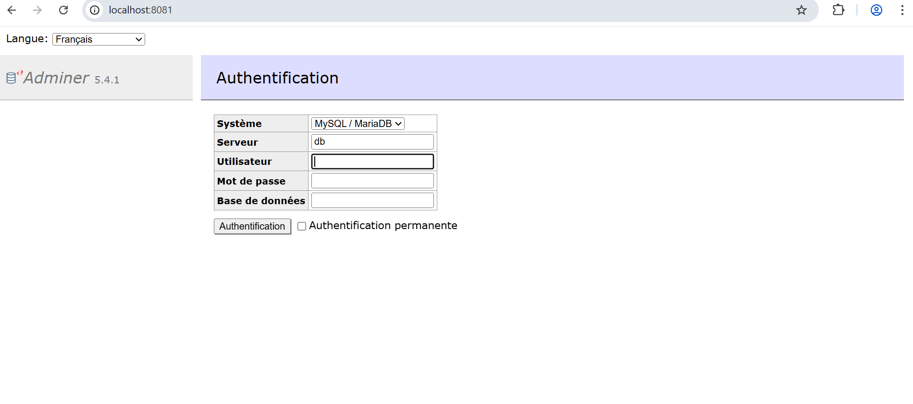
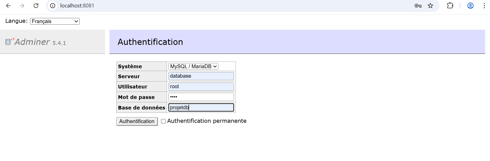
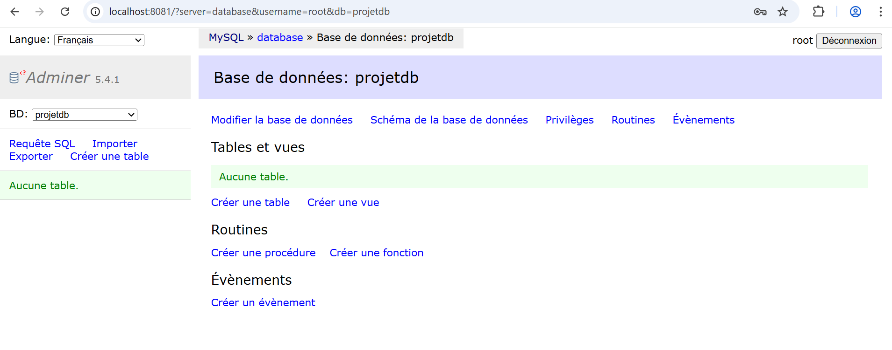
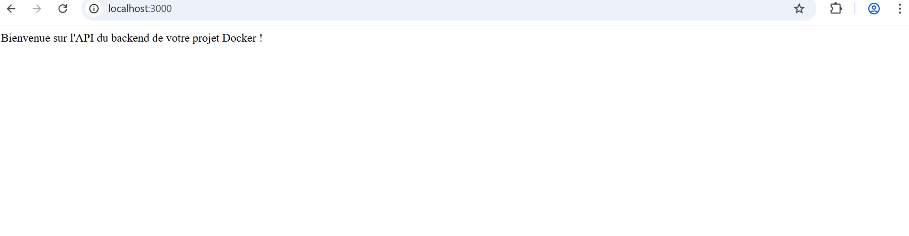
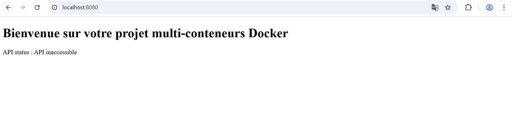
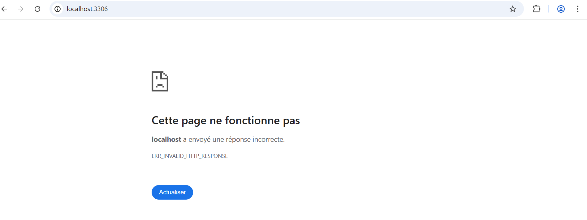
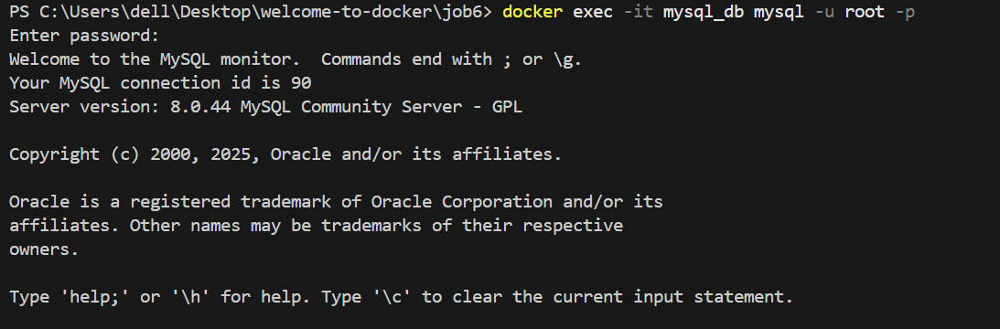
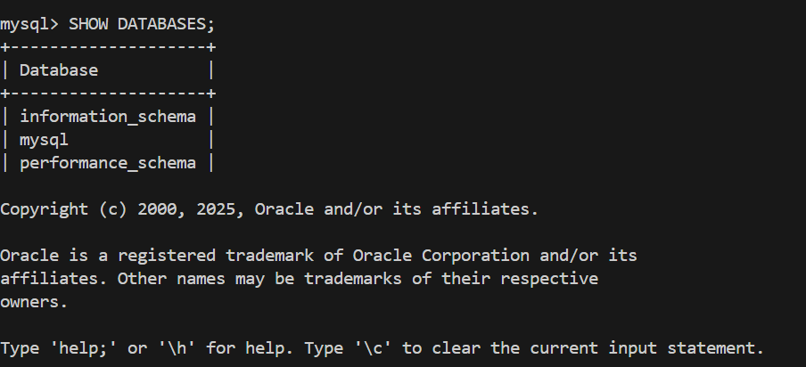
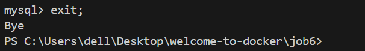

## On lance docker-composer en arrière plan avec docker-compose up -d

## Accès à Adminer via l'URL http://localhost:8081 pour gérer la base de données

## On insére les bons infos

## Après authentification sur Adminer

## Accès au backend via l'URL http://localhost:3000

On voit bien le message de bienvenue

## Accès au frontend via l'URL http://localhost:8080 affichant l'état de l'API

## Accès à mysql via l'URL http://localhost:3306

On remarque qu'il ya une erreur

# Accès a la base de donnée par terminal

On tape la commande suivante pour entrer dans le conteneur et lancer mysql: docker exec -it mysql_db mysql -u root -p

Après on tape le mdp root et la commande SHOW DATABASES;

pour quitter on tape la commande exit;

